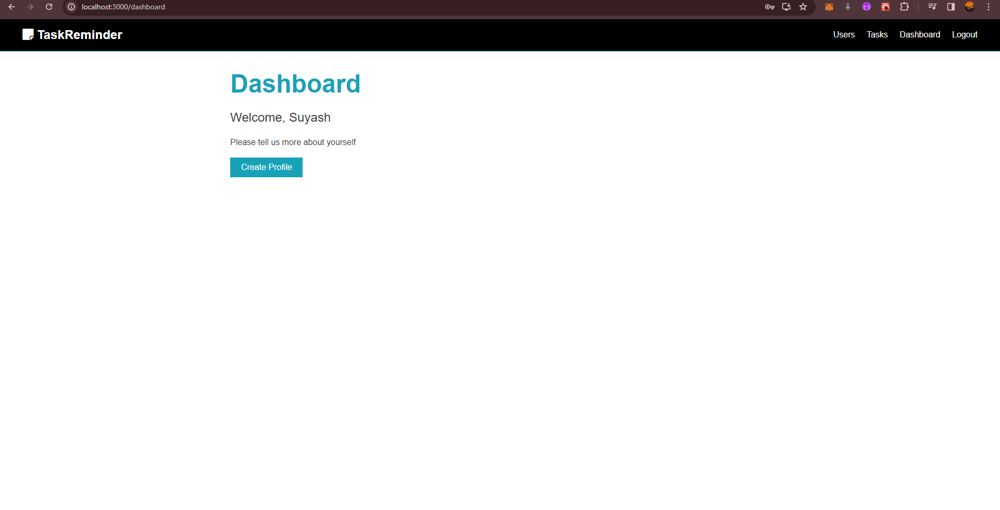
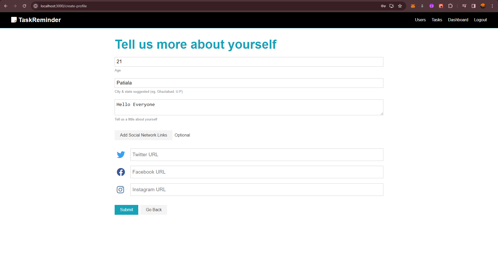

# To-Do-Task-Reminder-App

To-Do List With Task Reminder A MERN stack app to remind / notify user of Task due on that day on a daily Basis. 
Uses Cron to send email daily at 8 in the morning to notify user of Due tasks for the day.

# Screenshots :

